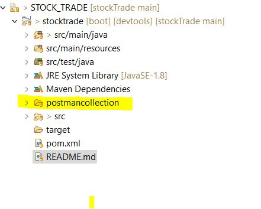
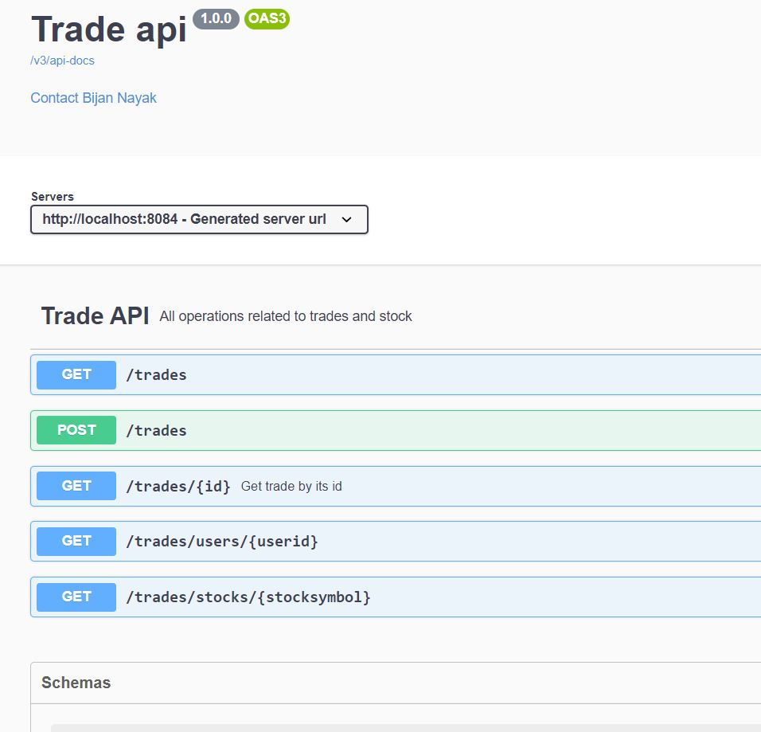
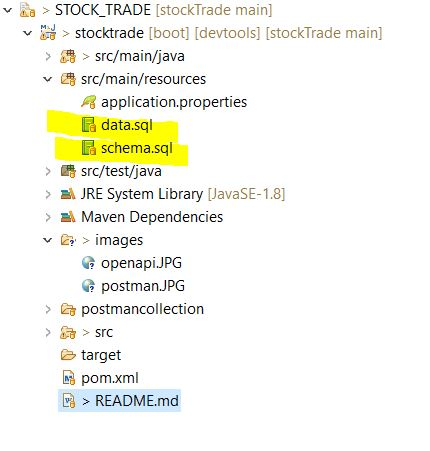
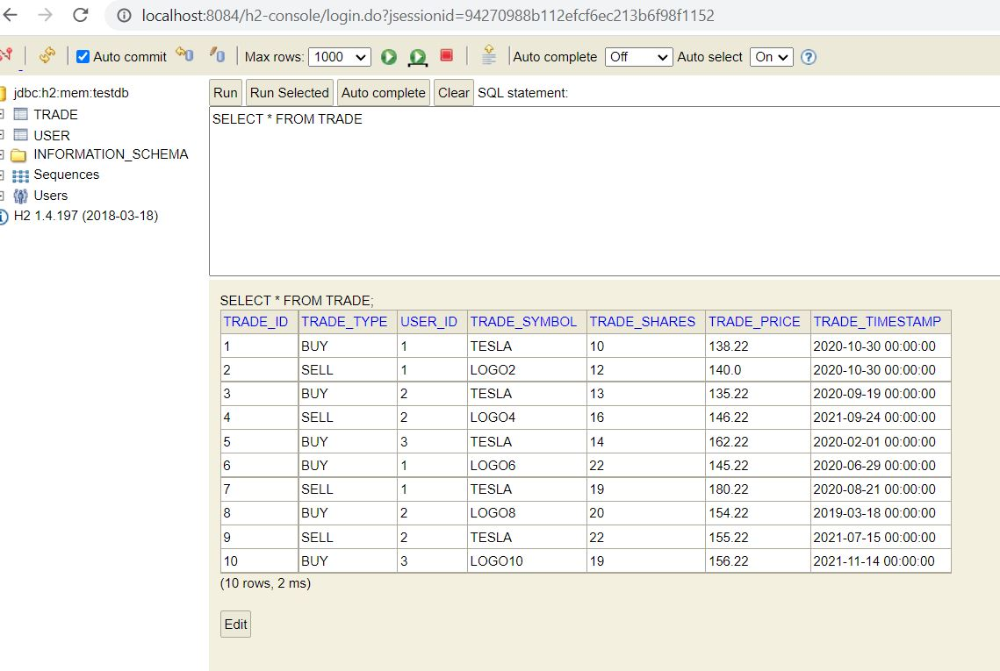

# Stock Trade API

## Set up and run

### postman :

 kindly clone the repository from github and run it on localhost:8084 
with corresponding operations .

> postman collection is added to the project 

### Open api :

the link for open api is : http://localhost:8084/swagger-ui.html

### data and schema sql files : 

### H2 in memory database:

> path: localhost:8084/h2-console

